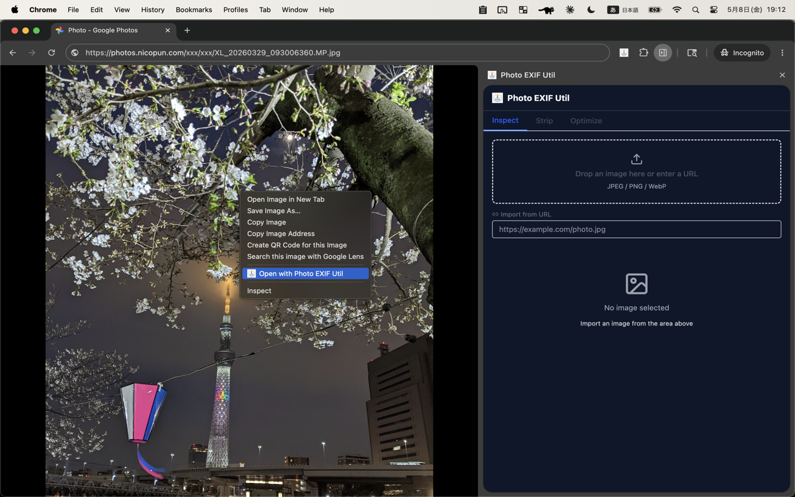
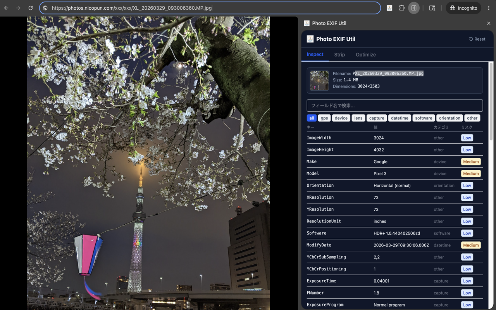
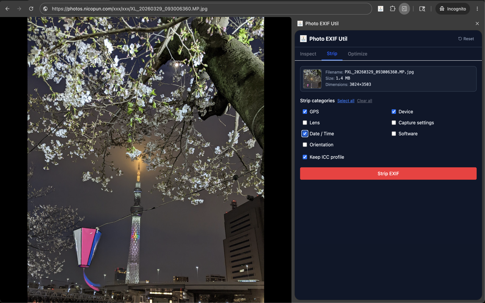
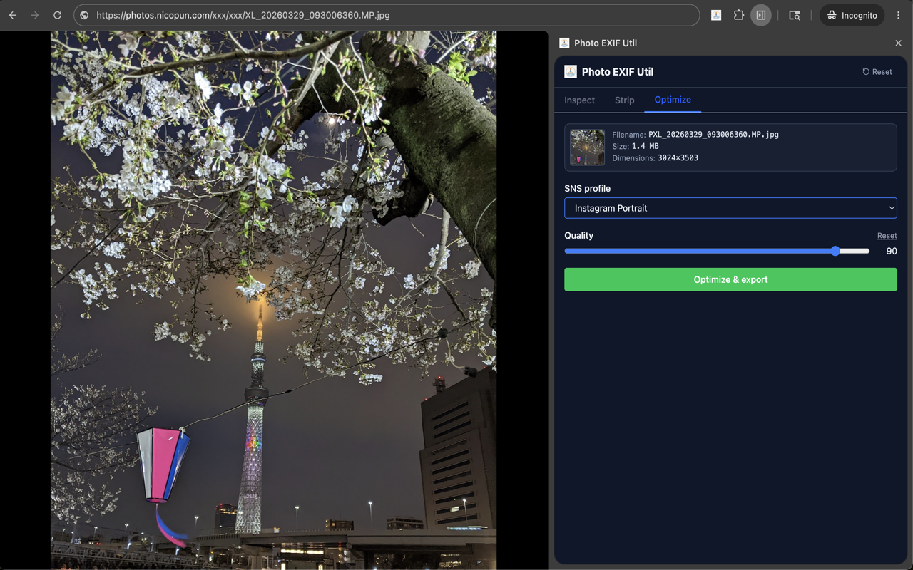

  

<h1 align="center">Photo EXIF Util</h1>

  Chrome extension to view, analyze, and strip EXIF metadata from photos. 
  <strong>Fully client-side</strong> — no data ever leaves your device.

## Features

- 📷 Inspect EXIF metadata of JPEG / PNG / WebP images instantly
- 🗺️ **Visualize privacy risks** (GPS coordinates, camera serial numbers, etc.)
- 🧹 Strip metadata by category and download a clean image
- 📐 Optimize images for **11 SNS profiles** (X, Instagram, LINE, Bluesky, …)
- 🌗 Light / Dark / system-preference theme
- 🇯🇵 🇺🇸 i18n: Japanese / English

## Screenshots

<table>
  <tr>
    <td width="50%"></td>
    <td width="50%"></td>
  </tr>
  <tr>
    <td></td>
    <td></td>
  </tr>
</table>

## Install

### Chrome Web Store

[Install from the Chrome Web Store](https://chromewebstore.google.com/detail/photo-exif-util/jfofoaeeaeonemgkamhiefekfgfjbamd)

### Developer build (manual install)

1. Download `photo-exif-util-v<VERSION>.zip` from the [Releases page](https://github.com/mkontani/photo-exif-util/releases) and unzip it
2. Open `chrome://extensions/` and enable **Developer mode**
3. Click **Load unpacked** and select the unzipped folder

## Usage

1. Open the side panel via:
   - The toolbar icon → **Open side panel**, or
   - Right-click an image → **Open with Photo EXIF Util**, or
   - Keyboard shortcut `Ctrl+Shift+E` (macOS: `⌘+Shift+E`)
2. Provide an image by drag-and-drop, file picker, or URL
3. Use the **Inspect / Strip / Optimize** tabs to operate

## Browser compatibility

| Browser | Side panel | Note |
|---|---|---|
| Chrome / Edge / Brave (Chromium 116+) | ✅ Works natively | |
| Vivaldi | ⚠️ Manual Web Panel setup required | See below |

### Vivaldi: manual side panel setup

Vivaldi does not yet wire the Chromium `chrome.sidePanel` API up to its sidebar
UI (the API call resolves silently but no panel appears). As a workaround,
register Photo EXIF Util as a **Web Panel** in Vivaldi's sidebar:

1. Open `vivaldi://extensions/` and copy the **extension ID** of Photo EXIF
   Util (a long hash such as `hdonilpdcgefacepilobkebniklaomld`).
2. Build the side-panel URL:
   `chrome-extension://<EXTENSION_ID>/src/ui/side-panel/index.html`
3. Click the **+** at the bottom of Vivaldi's sidebar → **Add Web Panel** →
   paste the URL → confirm.
4. Click the new Web Panel icon in the sidebar to open Photo EXIF Util.

After registration:

- **Right-click → Open with Photo EXIF Util** still works — the image URL is
  handed off via `chrome.storage.session`, and the Web Panel picks it up the
  next time it's open. Open the Web Panel from the sidebar first if it isn't
  already shown.
- The **toolbar icon** and **`Ctrl+Shift+E`** shortcut are no-ops in Vivaldi
  because they rely on the unimplemented `chrome.sidePanel.open` API. Use the
  sidebar Web Panel icon instead.

If a future Vivaldi release implements `chrome.sidePanel`, the extension will
work without this manual setup automatically.

## Privacy

This extension **never sends image data outside your device**. All processing
happens locally in the browser. See [PRIVACY.md](./docs/PRIVACY.md) for details.

## Development & Contributing

See [CONTRIBUTING.md](./CONTRIBUTING.md) for development setup and conventions.
Release flow is documented in [docs/RELEASE.md](./docs/RELEASE.md).

## License

[MIT](./LICENSE) © 2026 Photo EXIF Util Contributors
